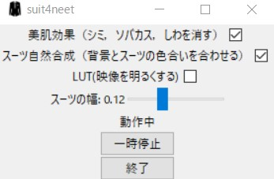
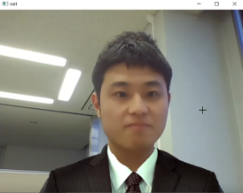

# Virtual Suit (Suit For Neet)
このプログラムはカメラ画像から人を認識し，仮想スーツを着用させることが可能なプログラムです．  
OBSをインストールしていれば，そのままZOOMやGoogle Meet,Teamsなどで仮想スーツを着用可能です．

このプログラム自体には，大まかに以下の機能があります．  

* **スーツ自然合成機能**  
    (灰色世界仮説による照明色推定から色の正規化を行い背景の照明色と合わせる) 
* **美肌機能（シミ，シワ，ソバカスを消す）**
* **映像調整機能（LUT）**

これらは簡単にGUIから操作できます．

|||
|:---:|:---:|
|||
|操作画面|出力画面|

 
ぜひ使ってみてください
    
# ダウンロード
ポータブル版はインストールが不要ですが，初回の起動は遅いのでご注意ください．    
## Windows 版 
| | |  
|:--:|:--:|  
|ポータブル版|[ここからダウンロード](https://github.com/STU-Idichi-Syoya/virtual-suit/releases/)  
|インストール版|[現在準備中です]()  
  
## Mac版  
| | |  
|:--:|:--:|  
|ポータブル版|[現在準備中です]()  
|インストール版|[現在準備中です]()  
  

## Linux(Ubuntuなど)  
| | |  
|:--:|:--:|    
|ポータブル版|[現在準備中です]()  
|インストール版|[現在準備中です]()  
  
## 使い方  
ダウンロードしたら，それぞれの実行ファイルを実行するだけです．  

# 名前の由来(Neets For Suit)    

>昨今では就活はオンライン面接の場合が多く，企業によっては，スーツで面接することを義務付けられる場合があります．  
>しかしながら，スーツを着たところで，生産性が上がるわけではないし，頭が良くなることはありません．緊張感が増すだけです．  
>また，オンライン面接のためだけにスーツを買うというのも無駄に思えます．  

以上のような，私のような面倒くさがり屋で**Neet**のような考え方を持つ人のために，このプログラムを作成しました．
# ソースコード  
公開していません．    
私が卒業研究で照明色推定の研究をしており，  
学会等で成果を出せば，公開する予定です．  
その際は，よりよい合成結果になることが期待されます．  
（もしかしたら，世界一になるかもしれません)
